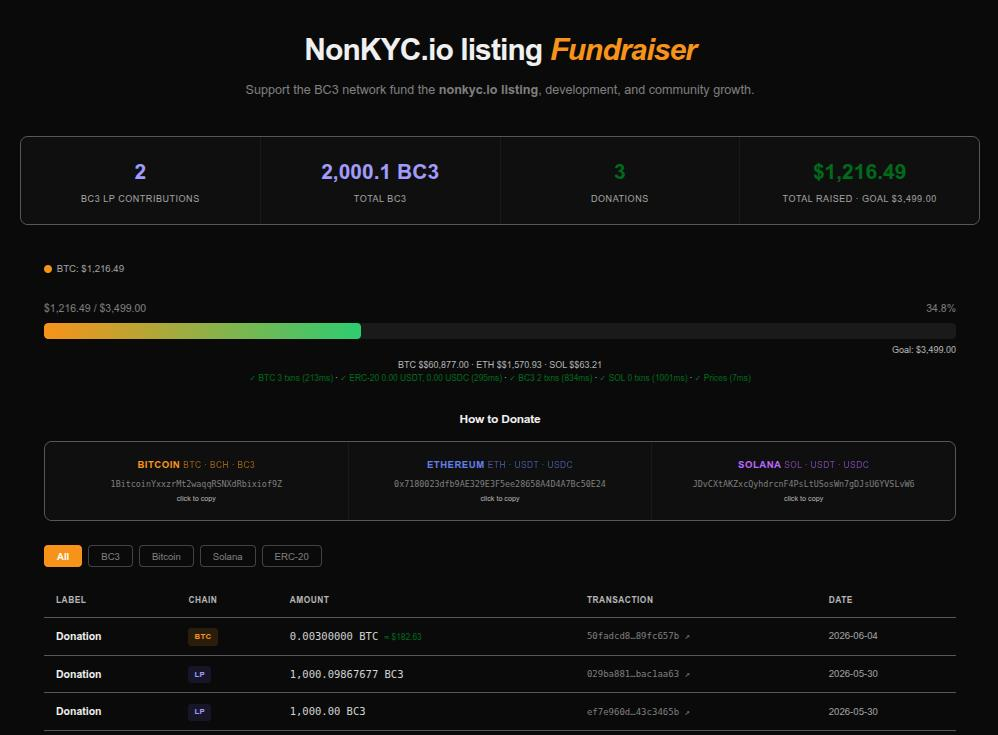

# BC3 Network Fundraiser Dashboard

This repository contains a static dashboard for the BC3 Network NonKYC.io listing fundraiser.

Live site: https://bc3-nonkyc.tbtechvn.com/ - site is online for anyone to view.

## Screenshot

The page shows:

- Live fundraising progress toward the USD goal
- Donation history and transaction breakdowns
- Current balances for supported chains and tokens
- Copy-to-clipboard donation addresses

## Donation Addresses

### Funding

| Network | Address |
| --- | --- |
| Bitcoin | `1BitcoinYxxzrMt2waqqRSNXdRbixiof9Z` |
| Ethereum / ERC-20 | `0x7180023dfb9AE329E3F5ee28658A4D4A7Bc50E24` |
| Solana | `JDvCXtAKZxcQyhdrcnF4PsLtUSosWn7gDJsU6YVSLvW6` |

### Development and Operations

| Network | Address |
| --- | --- |
| BC3 | `bc1quvzj0cfk3cl7af0wp7ag0sjdx53zkfc7v5y4um` |
| ETC / ERC-20 | `0x6e8e3c2b31424266e7cff59e910df1587c317427` |
| BTC | `bc1qzzvcguvqjc6qhwe2y5vy38w2zke7hksukjhm68` |
| SOL | `GGEaCMpnyM8tB5BU4RMuLm6tgMr3q9FgMHodxDxxAGby` |
| LTC | `MPfm5QLKH1r9XxgWmH75Gyps4LDfX5c53L` |

## Notes

- The dashboard is implemented as a single `index.html` page.
- Donation addresses on the page can be clicked to copy them to the clipboard.
- The page fetches live blockchain and price data from external services.
